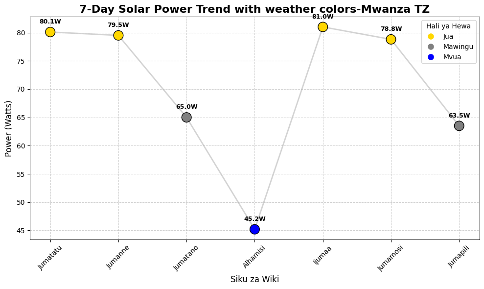

# UNSHAKABLE ENERGY AI

### Project Overview

Project hii inachambua jinsi 'Hali ya Hewa' inavyoathiri 'Solar Power Output' Mwanza, Tanzania.
Lengo: Kubadilisha data ghafi kuwa 'maamuzi ya kibiashara' kwa kutumia python

### Key Findings
- **Jua**: 80.1w Wastani
- **Mawingu**: 64.25w Wastani
- **Mvua**: 45.2w - Pungufu la 44.20% - ikilinganishwa na jua
- Graph inatumia mfumo wa rangi: Dhahabu = Jua, Kijivu = Mawingu, Bluu = Mvua

### Tech stack
- python: pandas, matplotlib, scikit-learn
- Data Analysis + Weather API
- Solar Output Modeling

### Visualization

### Nini nilijifunza
1.Data halisi inashinda makadirio kila wakati
2.Rangi kwenye data = Muda mdogo wa kuelewa pattern

 ### Author
 Seleman Maganga Michael- Solar Energy+AI Enthusiast
 Mwanza, Tanzania

 #Solar Energy #Data Science #Python #RenewableEnergy #AI #Tanzania
