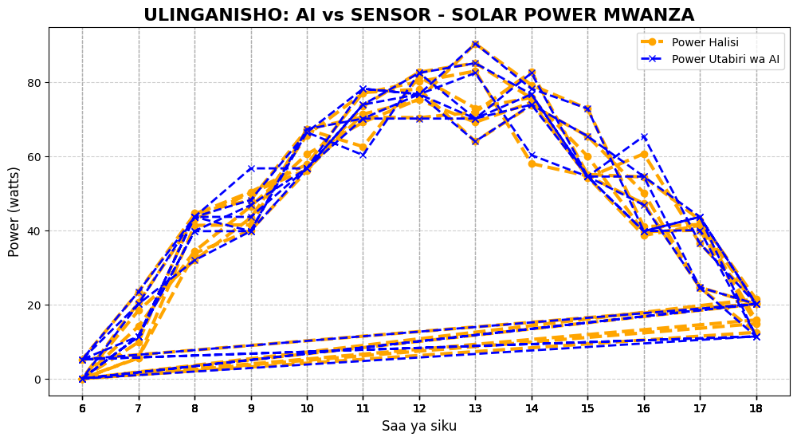

# UNSHAKABLE ENERGY AI

### Project Overview

Project hii inachambua jinsi 'Hali ya Hewa' inavyoathiri 'Solar Power Output' Mwanza, Tanzania.
Lengo: Kubadilisha data ghafi kuwa 'maamuzi ya kibiashara' kwa kutumia python

### Key Findings
- **Jua**: 80.1w Wastani
- **Mawingu**: 64.25w Wastani
- **Mvua**: 45.2w - Pungufu la 44.20% - ikilinganishwa na jua
- Graph inatumia mfumo wa rangi: Dhahabu = Jua, Kijivu = Mawingu, Bluu = Mvua

### Tech stack
- python: pandas, matplotlib, scikit-learn
- Data Analysis + Weather API
- Solar Output Modeling

### Visualization

### Nini nilijifunza
1.Data halisi inashinda makadirio kila wakati
2.Rangi kwenye data = Muda mdogo wa kuelewa pattern

 ### Author
 Seleman Maganga Michael- Solar Energy+AI Enthusiast

 
 Mwanza, Tanzania

 #Solar Energy #Data Science #Python #RenewableEnergy #AI #Tanzania

## ## UNSHAKABLE ENERGY AI MACHINE LEARNING
AI model for predicting solar power output in Mwanza , Tanzania ,using weayher data.

## Problem
Solar power fluctualates due to clouds, heat, and light. This  causes unstable energy for homes.

## Solution
Machime learning model that forecasts 'Power_W' using 'saa, joto, mwangaza, mawingu'
## Tech stack
-Python, pandas,scikit-Learn,Linear Regression,Random Forecast'

## Roadmap
- [x] week 1: Data cleaning and Analysis
- [ ] week 2: Train/Test split and first model-COMPLETED R^2=0.985
- [ ] week 3: Model Evaluation
- [ ] week 4: Deployment

## Week 2: AI Model Validation and Visualizatio
- [x] Train AI Model with RandomForest
- [x] Model Accuracy: R^2= 0.985
- [x] Validation Graph: AI vs sensor
- [ ] %Loss Analysis bar chart
- [ ] Correlation Heatmap

## Latest Result: AI vs Sensor Graph

*Blue Dotted = AI prediction | orange= real sensor Data

## Dataset
Real solar data collected in Mwanza Tanzania.

Bult as part Block 6: 1% Daily.
